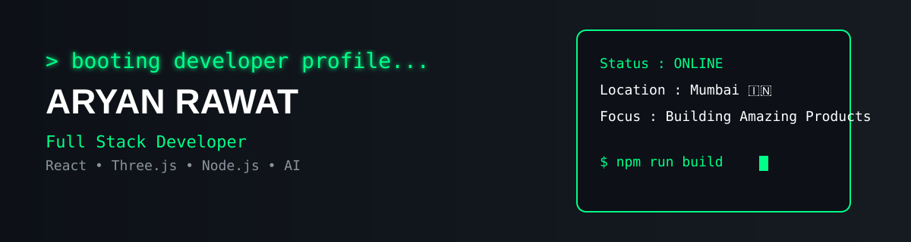

<div align="center">

#  Hey, I'm Aryan Rawat



<br>


<br>


</div>

---

## 🚀 About Me


```ts
const aryan = {
  name: "Aryan Rawat",
  title: "Full Stack Developer",

  location: "Mumbai, India 🇮🇳",

  education: "B.E. Information Technology",

  currentlyWorkingOn: [
    "Smart India Hackathon 2026",
    "GITS Platform",
    "Modern Full Stack Applications"
  ],

  currentlyLearning: [
    "System Design",
    "DevOps",
    "Artificial Intelligence"
  ],

  interests: [
    "Web Development",
    "Three.js",
    "Open Source",
    "UI/UX",
    "Problem Solving"
  ],

  motto: "Build. Learn. Improve. Repeat."
};
```
## 🛠️ Tech Stack

<div align="center">


</div>
---

## 📊 GitHub Analytics

<div align="center">


</div>

<div align="center">


</div>
---

## 🏆 GitHub Trophies

<div align="center">


</div>